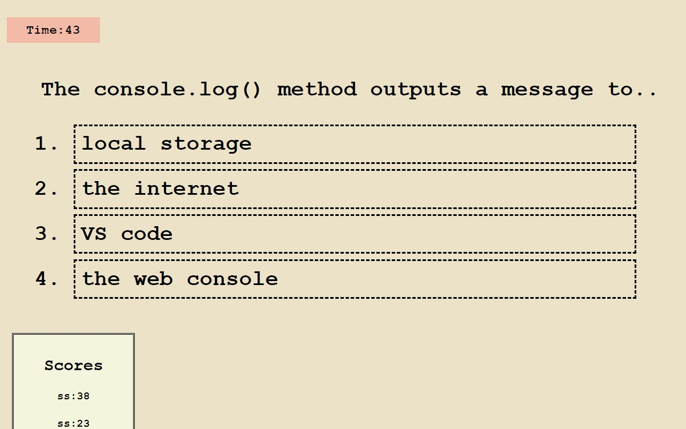

# Quizanator
https://salvadorbanuelos424.github.io/Quizanator/

## Purpose
Test your web development knowledge with these 5 questions.  A timer will begin automatically when the quiz starts, and a wrong answer will deduct 5 seconds from the timer.  Your score will be the remaining time of the timer, and scores are stored automatically to localStorage.  Good luck!

## Installation
* Git clone repository from 
* no npm installation

## Built With
* HTML 
* CSS
* JS

## Website

## Contributing
Open to all contributions

## Questions
Feel free to reach out GitHub or email if you have any questions

## GitHub URL
https://github.com/SalvadorBanuelos424/Quizanator

## Email
* SBanuelos1234@gmail.com

Made with ❤️ by Salvador Banuelos
### © 2022 Quizanator, Inc.